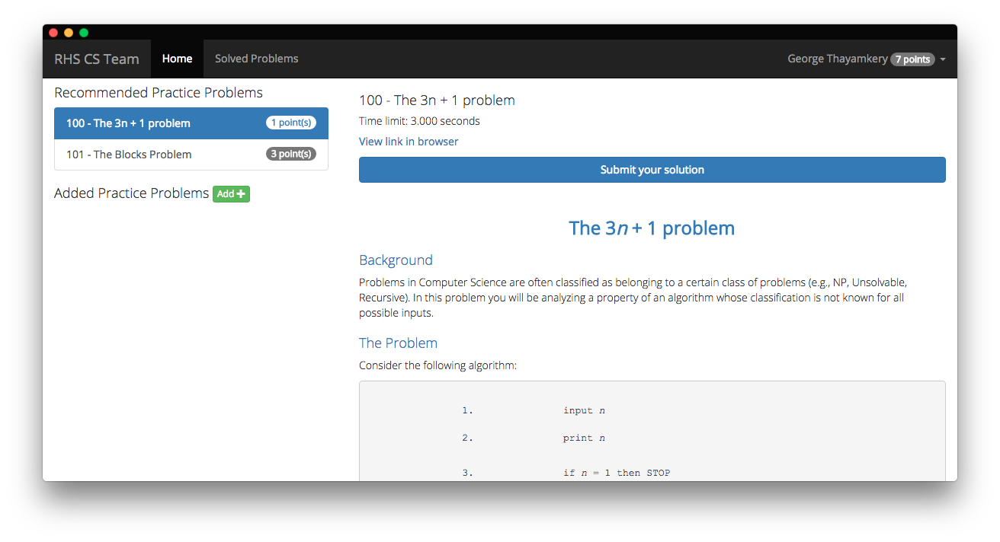

# RHS CS Practice Problem System (PPS)
<p align="center">

</p>
Team members use this tool to solve questions and get points for solving them. Users select a practice problem from [https://uva.onlinejudge.org/](UVa Online Judge), copy and paste the problem into program, and run their solution through the program.

Feel free to use this in your setting too.

## Dependencies
* NodeJS
* npm
* Electron
* Firebase [http://firebase.google.com](Firebase)
  
## Installation
* clone the repo
* `cd` into the app directory
* run `npm install` to install the dependancies
* edit your settings.js file to have incorporate your Firebase keys
* run `npm start` to start

## `settings.js`

This has all of your Firebase credentials. Maybe in the future, more customizable settings or plugins will come.

It should look like this:
```javascript
window.settings = {
  FirebaseCredentials:{
    apiKey: "XXXXXXXXXXXXXXXXXXXXXXXXXXXXXXXXXXXXX",
    authDomain: "XXXXXXXXXXXXXX.firebaseapp.com",
    databaseURL: "https://XXXXXXXXXXXXXXXXX.firebaseio.com",
    storageBucket: "XXXXXXXXXXXXXXXXXX.appspot.com",
  },

}

```

**Remember to save it as settings.js**


## Setting up Firebase
* Go to [http://firebase.google.com](Firebase)
* Click "Get started for free"
* Create a new Firebase Project
* Once in the dashboard, navigate to the Auth section
* In the sign-in method tab, enable the "Email/Password" signin method. This is how cs-points authenticates the user
* Now, go to the database section
* Click on the rules tab, and add these rules
```json
{
  "rules": {
    "featured_problems":{
      ".read":true,
      ".write":false
    },
    "solved_problems":{
      ".read":true,
      ".write":true
    },
    "users": {
      "$uid": {
        ".write": "$uid === auth.uid",
        ".read":true
      }
    }
  }
}
```
* Now you're done!

## Adding Featured Problems

cs-points allows you to feature problems and assign weight to the problem. To do this, go to the Firebase console and navigate to the database tab.

This is where you would add your featured problems. **(Any collapsed item is automatically generated by the app)**


To add a featured_problem click on the plus button on the root parent of the heirarchy


Then type `featured_problems` in the `Name` field and press the `+` button on the right


Type a **Unique ID** for the problem in the `Name` field and press the plus button to add the child properties


Featured problem properties:
* `unique ID`
  * `name` - The exact name of the problem that is shown on UVa
  * `url` - The UVa URL of the problem
  * `weight` - The number of points given to the user if they solve the problem


## PR's much appreciated


